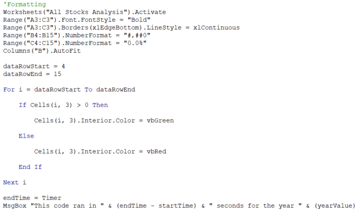
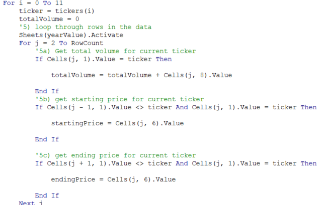
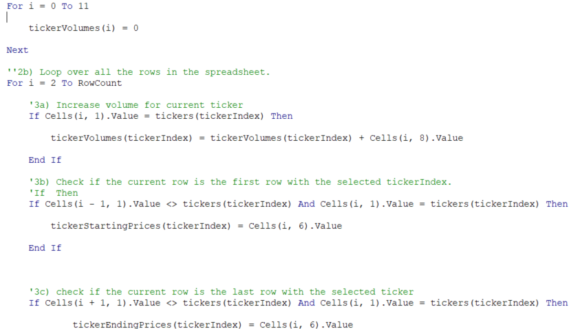
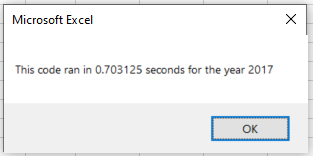
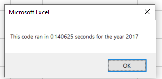

# VBA of Wall Street

## Overview of Project

### Purpose

We are helping Steve diversify his parents' portfolio. With the data Steve has provided, we will use automated processes through the use of VBA in Excel to analyze and highlight this information.

## Analysis

### Results

After analyzing the data, we were able to determine that DQ returned 199.4% in 2017 but did not do as well in 2018 returning -62.6%. Steve was right in wanting to diversify his parents' portfolio. When working with this much data, it is quite easy to get lost. To make things a little easier for Steve, we've created buttons to analyze the data according to the year as well as color code tickers with green for gains and red for losses. We wil also show Steve how long the analysis takes.

#### Code for Formatting

## Summary

### Advantages and disadvantages of refactoring code in general
The main advantages in refactoring code would be to save processing power and time. One disadvantage I could see would be the time and effort it takes to refactor the code. We can see that the refactored code is actually longer and more complicated than the original code

#### Orignal:

#### Refactored:

### Advantages and disadvantages of the original and refactored VBA Script

Our original code from the modules was simpler and required less lines of code, however as we can see the process takes longer (.703 seconds):
#### Old Code

Compared to our newly refactored code(.140 seconds):
#### Refactored Code

